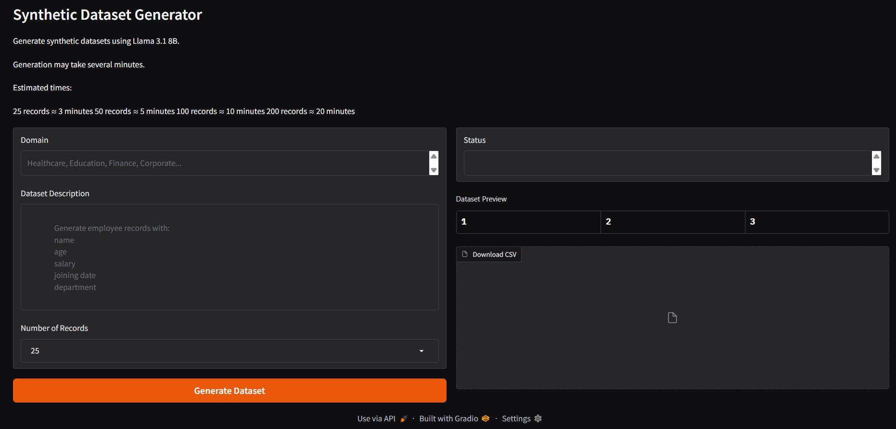
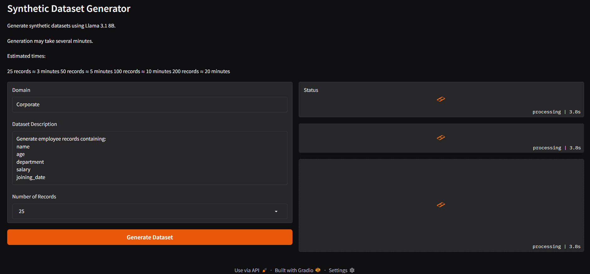
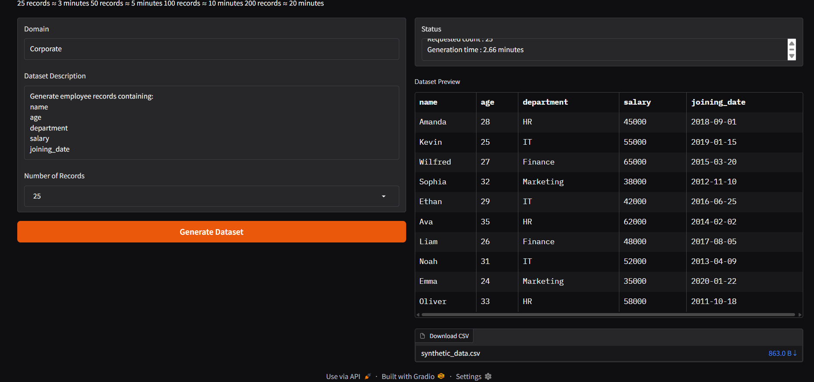
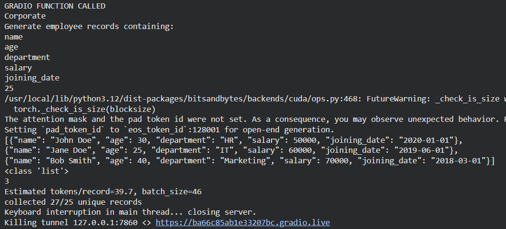

# Synthetic Dataset Generator using Llama 3.1 8B

Generate structured synthetic datasets from natural language descriptions using Meta-Llama-3.1-8B-Instruct with 4-bit quantization and a Gradio interface.

---

## Overview

This project uses **Meta-Llama-3.1-8B-Instruct** to create structured synthetic datasets based on user requirements.

Users specify:

* Domain (Healthcare, Finance, Education, Corporate, etc.)
* Dataset description
* Number of records

The application dynamically estimates output token usage, calculates an optimal batch size, repeatedly queries the model, removes duplicate records, validates JSON responses, and exports the final dataset as a CSV file.

The project was developed and tested on **Google Colab Free Tier (T4 GPU)**.

---

## Features

* Meta-Llama-3.1-8B-Instruct inference
* 4-bit quantization using BitsAndBytes
* Automatic token estimation
* Dynamic batch-size calculation
* JSON-only generation
* Duplicate record removal
* Retry mechanism for invalid outputs
* CSV export
* Gradio web interface
* Dataset preview before download

---

## Architecture

```
User Input
     ↓
Gradio UI
     ↓
Prompt Construction
     ↓
Token Estimation
     ↓
Batch Size Calculation
     ↓
Llama 3.1 8B Inference
     ↓
JSON Validation
     ↓
Duplicate Removal
     ↓
Collect Unique Records
     ↓
Pandas DataFrame
     ↓
CSV Export
```

---

## Tech Stack

* Python
* Transformers
* Hugging Face
* Meta-Llama-3.1-8B-Instruct
* BitsAndBytes
* PyTorch
* Pandas
* Gradio
* Google Colab

---

## Model

Model used:

```
meta-llama/Meta-Llama-3.1-8B-Instruct
```

The model is loaded in **4-bit NF4 quantized format** to reduce GPU memory requirements.

---

## System Requirements

### Tested Environment

Google Colab Free Tier 

GPU:

* NVIDIA T4
* 15 GB VRAM

System RAM:

* 12.7 GB

Storage:

* 112.6 GB temporary storage

Python:

* 3.11+

---

## Installation

Install dependencies:

```bash
pip install bitsandbytes accelerate transformers==4.57.6 torch pandas gradio huggingface_hub
```

---

## Access to Llama 3.1

Before running the project:

### 1. Create a Hugging Face account

https://huggingface.co

### 2. Request access to Meta-Llama-3.1-8B-Instruct

https://huggingface.co/meta-llama/Meta-Llama-3.1-8B-Instruct

You must:

* Accept Meta's license agreement.
* Wait for access approval.

### 3. Generate a Hugging Face access token with write permission

Settings → Access Tokens → +Create new token button → Token type: write

### 4. Store the token

For Google Colab:

```
HF_TOKEN
```

The notebook reads the token from:

```python
userdata.get('HF_TOKEN')
```

---

## Running the Project

```python
gradio_ui.launch()
```

Open the Gradio interface and provide:

### Domain

Examples:

* Healthcare
* Finance
* Education
* Retail
* Human Resources

### Dataset Description

Example:

```
Generate employee records with:

name
age
salary
department
joining_date
```

### Record Count

Supported values:

* 25
* 50
* 75
* 100
* 125
* 150
* 175
* 200

---

## User Interface

### UI



---

### Dataset Generation



---

### Generated Dataset Preview



---

## Future Improvements

* Multiple model support
* Audio dataset generation
* JSON and Excel export

---

## Sample Output

Input:

Domain:

```
Corporate
```

Description:

```
Generate employee records containing:
name
age
department
salary
joining_date
```

Output:

| name    | age | department | salary | joining_date |
| ------- | --- | ---------- | ------ | ------------ |
| Amanda  | 28  | HR         | 45000  | 2018-09-01   |
| Kevin   | 25  | IT         | 50000  | 2019-01-15   |
| Wilfred | 27  | Finance    | 65000  | 2015-03-20   |

The generated dataset is exported as:

```
synthetic_data.csv
```

A sample CSV generated by the application is included in:

```text
outputs/sample_dataset.csv
```

You can inspect the file to see the structure of generated synthetic records.

---

## Internal Workflow

### Token Estimation

The model first generates a small sample to estimate average tokens per record.

### Batch Size Calculation

The available output token budget is used to determine the number of records that can safely be generated in one inference call.

### JSON Validation

Only valid JSON arrays are accepted.

Invalid outputs trigger automatic retries.

### Duplicate Removal

Records are hashed and stored inside a set to ensure uniqueness.

### Export

Final records are converted to a Pandas DataFrame and exported to CSV.

### Backend Flow



---


## Limitations

* Generation quality depends on prompt quality.
* LLM responses may occasionally contain invalid JSON.
* Large datasets increase generation time.
* Duplicate values may require additional retries.

---

## License

This repository contains code licensed under the MIT License.

The Meta-Llama-3.1 model itself is subject to Meta's Llama 3.1 Community License.

See:

https://huggingface.co/meta-llama/Meta-Llama-3.1-8B-Instruct

---

## Author

Praveen Kumar T

MCA Graduate

Python • LLMs • Generative AI • Flask