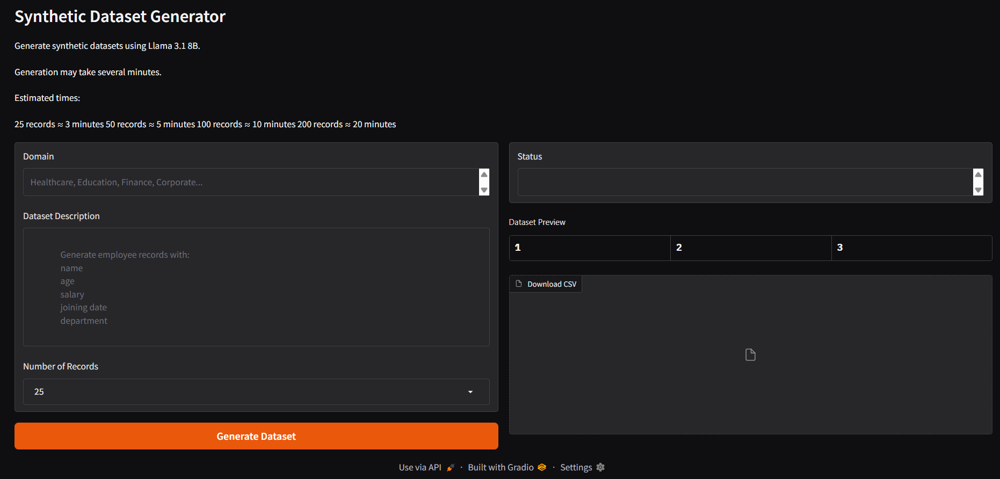
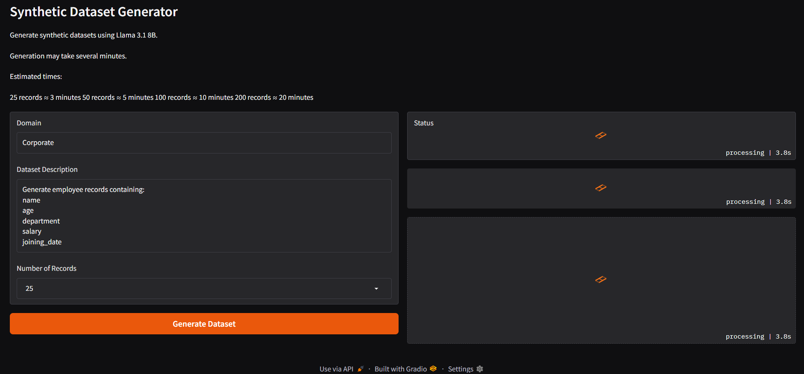
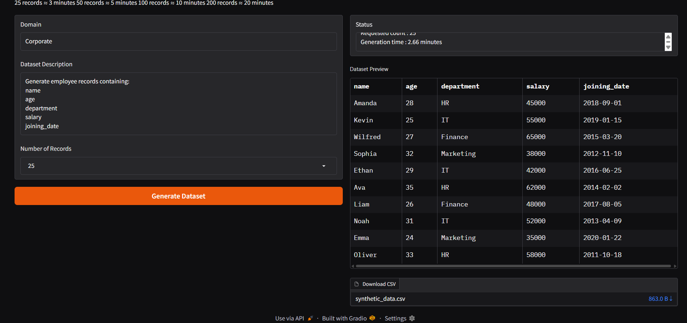

# Synthetic Data Generator

Generate structured synthetic datasets from natural language descriptions using local and API-based Large Language Models (LLMs) through a unified interface.

---

## Overview

This project generates structured synthetic datasets from natural language descriptions.

Users specify:

- Domain
- Dataset description
- Number of records

The application constructs prompts, estimates token usage, calculates an appropriate batch size, repeatedly queries the selected LLM, validates JSON responses, removes duplicate records, and exports the final dataset as a CSV file.

The project supports both **local Hugging Face models** and **OpenAI-compatible API providers**.

Currently tested models include:

- Meta-Llama-3.1-8B-Instruct
- GPT-4.1-mini
- Gemini 3.6 Flash

The project was originally developed and tested on **Google Colab Free Tier with an NVIDIA T4 GPU** for local Llama inference.

---

## Features

- Multiple LLM support
- Local Hugging Face model inference
- OpenAI-compatible API support
- 4-bit quantization for local Llama inference
- Automatic token estimation
- Dynamic batch-size calculation
- JSON-only generation
- Duplicate record removal
- Retry mechanism for invalid outputs
- CSV export
- Gradio web interface
- Dataset preview before download
- Provider-independent dataset generation logic

---

## Architecture

```text
User Input
     ↓
Gradio UI
     ↓
Prompt Construction
     ↓
Dataset Generator
     ↓
LLM Abstraction
     ↓
 ┌───────────────┬───────────────────────┐
 │               │                       │
 ▼               ▼                       ▼
Local LLM    OpenAI-compatible API   Other Compatible APIs
 │               │
 ▼               ▼
Llama 3.1     GPT / Gemini / DeepSeek
 │
 └───────────────┬───────────────────────┘
                 ↓
          JSON Validation
                 ↓
          Duplicate Removal
                 ↓
        Collect Unique Records
                 ↓
          Pandas DataFrame
                 ↓
             CSV Export
```

---

## Project Structure

```text
Synthetic-Data-Generator/
│
├── app.py
├── colab_app.ipynb
├── config.py
├── dataset_generator.py
├── prompts.py
├── requirements.txt
├── ui.py
├── utils.py
│
├── llm/
│   ├── auth.py
│   ├── client.py
│   └── model.py
│
├── outputs/
│   ├── synthetic_dataset_llama.csv
│   ├── synthetic_dataset_gpt.csv
│   └── synthetic_dataset_gemini.csv
│
├── assets/
│   ├── ui.png
│   ├── generating_dataset.png
│   ├── dataset_preview.png
│   └── backend_flow.png
│
├── .gitignore
├── LICENSE
└── README.md
```

---

## Tech Stack

- Python
- PyTorch
- Transformers
- Hugging Face
- BitsAndBytes
- Pandas
- Gradio
- OpenAI Python SDK
- Google Colab

---

# Models

The project supports two types of model backends.

### Local Model

The project can run:

```text
meta-llama/Meta-Llama-3.1-8B-Instruct
```

The model is loaded using **4-bit NF4 quantization** to reduce GPU memory requirements.

### API Models

The project also supports models exposed through OpenAI-compatible APIs.

Currently tested:

```text
GPT-4.1-mini
Gemini 3.6 Flash
```

The same API abstraction can also be used with other compatible providers.

---

# Selecting a Model

Model selection is handled through `config.py`.

To switch between models, **comment out the configuration for the model you are not using and uncomment the configuration for the model you want to use.**

Only one provider/model configuration should be active at a time.

### Local Llama 3.1

```python
LLM_PROVIDER = "local"
LLM_MODEL = "meta-llama/Meta-Llama-3.1-8B-Instruct"
```

### GPT-4.1-mini

```python
# LLM_PROVIDER = "api"
# LLM_MODEL = "gpt-4.1-mini"
# BASE_URL = "https://api.openai.com/v1"
```

Uncomment the API configuration when using OpenAI.

### Gemini 3.6 Flash

```python
# LLM_PROVIDER = "api"
# LLM_MODEL = "gemini-3.6-flash"
# BASE_URL = "https://generativelanguage.googleapis.com/v1beta/openai/"
```

Uncomment the API configuration when using Gemini.

---

# System Requirements

## Local Llama Inference

The local model was tested using:

- Google Colab Free Tier
- NVIDIA T4 GPU
- 15 GB VRAM
- Approximately 12.7 GB system RAM
- Python 3.11+

The local Llama model requires significantly more resources than the API-based models.

API models do not require a local GPU because inference is performed by the respective provider.

---

# Installation

Clone the repository:

```bash
git clone https://github.com/RavenRT02/Synthetic-Data-Generator.git
cd Synthetic-Data-Generator
```

Install the required dependencies:

```bash
pip install -r requirements.txt
```

---

# Access to Llama 3.1

This section is required only when using the local Llama model.

### 1. Create a Hugging Face account

Create an account on Hugging Face.

### 2. Request access to Meta-Llama-3.1-8B-Instruct

Visit the model page:

```text
https://huggingface.co/meta-llama/Meta-Llama-3.1-8B-Instruct
```

You must accept Meta's applicable license agreement and obtain access to the model.

### 3. Create a Hugging Face access token

Create a Hugging Face access token with the required permissions.

### 4. Authenticate

For Google Colab, the notebook retrieves the Hugging Face token from Colab Secrets:

```python
from google.colab import userdata
from llm.auth import login_huggingface

login_huggingface(userdata.get("HF_TOKEN"))
```

---

# Running the Project

The main entry point is:

```text
app.py
```

Run:

```bash
python app.py
```

The application launches the Gradio interface in the browser.

For Google Colab, use:

```text
colab_app.ipynb
```

The notebook clones the repository, installs the dependencies, authenticates with Hugging Face, and starts the application.

---

# Using the Interface

Open the Gradio interface and provide:

### Domain

Examples:

- Healthcare
- Finance
- Education
- Retail
- Human Resources
- Corporate

### Dataset Description

Describe the structure and information you want in the generated dataset.

### Record Count

Choose the required number of records from the available options in the interface.

---

# Example: Healthcare Patient Dataset

The three example datasets in the `outputs/` folder were generated using the **same prompt** so that the outputs from different models can be compared.

### Domain

```text
Healthcare
```

### Description

```text
Generate patient records with the following fields:

patient_id
name
age
gender
admission_reason
```

The same healthcare/patient generation task was run using:

```text
Llama 3.1 8B
GPT-4.1-mini
Gemini 3.6 Flash
```

### Compare the Outputs

The generated CSV files are available in:

```text
outputs/
```

Look at the following files to compare how the different models handled the same prompt:

```text
outputs/synthetic_dataset_llama.csv
outputs/synthetic_dataset_gpt.csv
outputs/synthetic_dataset_gemini.csv
```

These files are provided as example outputs from the project.

> **Note:** The generated patient information is synthetic and fictional. It should not be treated as real medical data.

---

## User Interface

### UI



---

### Dataset Generation



---

### Generated Dataset Preview



---

# Internal Workflow

## Prompt Construction

The application constructs a system prompt and user prompt from the domain and dataset description provided through the UI.

The model is instructed to return the requested records as a JSON array.

## Token Estimation

Before generating the requested dataset, the application performs a small generation to estimate the average number of output tokens produced per record.

The token-counting implementation is handled by the selected LLM backend.

## Batch Size Calculation

The estimated tokens per record are used to calculate an appropriate batch size within the available output-token budget.

This allows the application to generate datasets in multiple batches rather than attempting to generate the entire dataset in a single request.

## JSON Validation

The generated response is parsed as JSON.

Only valid JSON arrays containing records are accepted.

Invalid responses trigger automatic retries.

## Duplicate Removal

Generated records are checked for duplicates before being added to the final dataset.

A set of unique record keys is used to prevent duplicate records from being included in the final output.

## Export

Once the requested number of unique records has been generated, the records are converted into a Pandas DataFrame and exported as:

```text
synthetic_data.csv
```

---

# LLM Abstraction

The project separates dataset-generation logic from the underlying model provider.

The `llm/` package contains:

```text
llm/
├── auth.py
├── client.py
└── model.py
```

### `client.py`

Provides the common LLM interface and supports:

- Local model inference
- OpenAI-compatible API inference

The dataset generator interacts with the LLM through a common `generate()` interface rather than directly interacting with a specific model or provider.

This allows the dataset-generation logic to remain independent of the underlying LLM.

### `model.py`

Handles loading and configuration of the local Hugging Face model.

### `auth.py`

Handles Hugging Face authentication.

---

# Limitations

- Generation quality depends on the selected model and prompt quality.
- LLM responses may occasionally contain invalid JSON.
- Large datasets increase generation time and API usage.
- Duplicate values may require additional generation attempts.
- API models require valid provider credentials and may incur usage costs.
- Local Llama inference requires a compatible GPU with sufficient VRAM.

---

# Future Improvements

- Additional model/provider integrations
- Audio dataset generation
- JSON and Excel export
- Further validation of generated records
- Additional dataset schemas and generation controls

---

# License

This repository contains code licensed under the MIT License.

The Meta-Llama-3.1 model itself is subject to Meta's Llama 3.1 Community License.

For Llama model access and licensing information, refer to the model's Hugging Face page:

```text
https://huggingface.co/meta-llama/Meta-Llama-3.1-8B-Instruct
```

---

# Author

Praveen Kumar T

MCA Graduate

Python • LLMs • Generative AI • Flask
